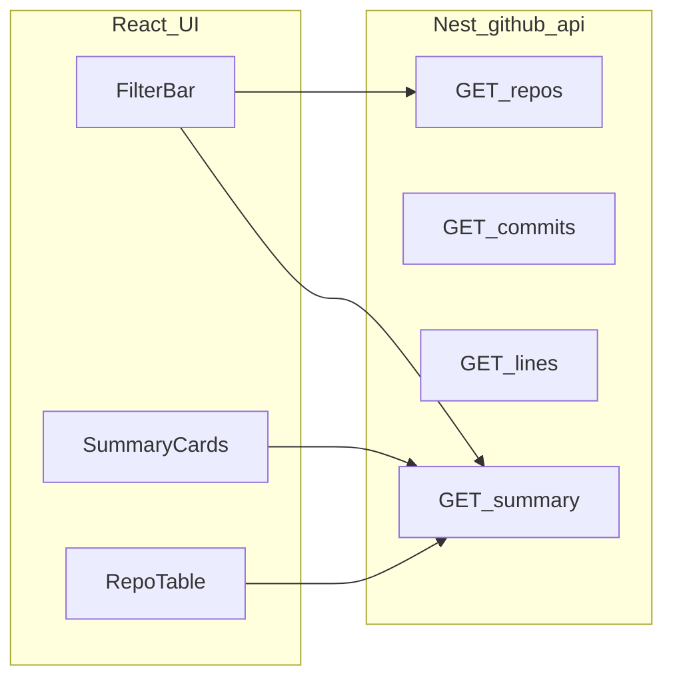

# GitHub API module — Frontend UI specification

This document describes how to build a **React** dashboard that consumes the NestJS **`github-api`** module, using **TanStack Query** for server state and **Radix UI** for accessible primitives. It is aligned with the current backend under [`src/github-api/`](../src/github-api/).

---

## 1. Goals and non-goals

### Goals

- Let users choose **organization/owner**, **date range**, optional **developer**, and **repositories**, then view:
  - repository list
  - commit counts per developer × repo
  - line change metrics (additions, deletions, net) per developer × repo
  - a **summary** with per-repo rollups and team totals
- Keep the UI responsive under slow GitHub-backed requests (loading, errors, empty states).

### Non-goals

- **No GitHub Personal Access Token in the browser.** The backend uses server-side `GITHUB_TOKEN` when calling GitHub.
- This spec does not require implementing GitHub OAuth in the frontend.

---

## 2. Tech stack

| Layer        | Choice | Notes |
|-------------|--------|--------|
| UI          | **React** (function components) | — |
| Server state | **TanStack Query** (`@tanstack/react-query`) | Use for all `GET` calls; stable query keys; avoid refetch storms. |
| Routing (optional) | **TanStack Router** | Optional: sync filters to URL (`from`, `to`, `owner`, `dev`, `repo`). |
| Primitives  | **Radix UI** | Use unstyled primitives; pair with your design tokens / CSS. |

### Suggested Radix packages (map to UI)

| UI block | Radix package | Role |
|----------|---------------|------|
| Filters in a panel | `@radix-ui/react-popover` or `@radix-ui/react-dialog` | Advanced filters, mobile-friendly |
| Repo select | `@radix-ui/react-select` | Single repo; multi-repo may use combobox pattern or multi-select |
| Tabs (Commits vs Lines vs Summary) | `@radix-ui/react-tabs` | Switch views without losing filter state |
| Scrollable wide table | `@radix-ui/react-scroll-area` | Horizontal scroll for many columns |
| Accessible table | Semantic `<table>` + Radix for toolbar/menus | Do not replace `<table>` with div-only grids for data tables |

---

## 3. Backend integration

### 3.1 Base URL and versioning

From [`src/main.ts`](../src/main.ts):

- **Global prefix**: `app.apiPrefix` (env: `API_PREFIX`, commonly `api`).
- **URI versioning**: `v1`.

Full pattern:

```text
{BACKEND_ORIGIN}/{API_PREFIX}/v1/github-api/...
```

Examples (placeholders only):

- Local: `http://localhost:3000/api/v1/github-api/repos`
- Production: `https://your-api.example.com/api/v1/github-api/summary`

Frontend env examples:

- Vite: `VITE_API_BASE_URL=http://localhost:3000/api`
- Next.js: `NEXT_PUBLIC_API_BASE_URL=http://localhost:3000/api`

Client base for this module:

```text
${API_BASE_URL}/v1/github-api
```

### 3.2 Routes (contract)

All routes are **GET**. Query serialization: standard `URLSearchParams` (array params are not used; use comma-separated `repos` as documented).

| Route | Path (relative to module base) | Query | Description |
|-------|--------------------------------|-------|-------------|
| List repos | `/repos` | `owner` (optional) | Returns repositories for an org via GitHub `GET /orgs/{owner}/repos`. |
| Commits | `/commits` | See [Query parameters](#34-query-parameters-querygithubapidto) | Aggregated commit counts per `developer` + `repo`. |
| Lines | `/lines` | Same as `/commits` | Additions, deletions, net per `developer` + `repo`. |
| Summary | `/summary` | Same as `/commits` | Per-repo rollups + overall `summary`; includes echo of `developer` filter label. |

### 3.3 Authentication (verify per deployment)

- The **`github-api`** controller in [`github-api.controller.ts`](../src/github-api/github-api.controller.ts) does **not** attach `InternalAuthGuard` in the current codebase.
- Other modules (e.g. `github-stats`) may use [`InternalAuthGuard`](../src/github-stats/guards/internal-auth.guard.ts): when `GITHUB_INTERNAL_TOKEN` is set, requests must send header `x-internal-token` with that value.
- **Action for frontend:** confirm with your deployed API and Swagger (`/docs`) whether `github-api` requires `x-internal-token`. If yes, add it to all `fetch` / axios calls.

### 3.4 Query parameters (`QueryGithubApiDto`)

Defined in [`query-github-api.dto.ts`](../src/github-api/dto/query-github-api.dto.ts).

| Param | Required | Type | Description |
|-------|----------|------|-------------|
| `from` | Yes | ISO 8601 string | Start of range (e.g. `2026-04-01T00:00:00Z`). |
| `to` | Yes | ISO 8601 string | End of range. |
| `owner` | No | string | Org/owner for repo resolution and GitHub paths. For **commits/lines/summary**, backend uses `owner ?? GITHUB_ORG ?? ''` (see `resolveOwner` in service). |
| `dev` | No | string | Passed to GitHub as `author` on list-commits when set. |
| `repo` | No | string | Single repo name (scoped stats). |
| `repos` | No | string | Comma-separated repo names (e.g. `a,b,c`). |
| `perPage` | No | integer 1–100 | Page size for GitHub list-commits pagination (default 100). |
| `bucket` | No | `day` \| `week` \| `month` | **See important note below.** |

#### Important: `bucket` vs current backend behavior

The DTO exposes **`bucket`**, but [`github-api.service.ts`](../src/github-api/github-api.service.ts) **does not use `bucket`** when aggregating. Grouping is always **per developer + per repository** for the given `from`/`to`.  

**UI recommendation:** hide `bucket` or label it “Coming soon” until the backend implements time-bucket rollups.

#### Important: `GET /repos` owner behavior

In `listRepositories`, if `owner` is omitted, the service uses a **hardcoded fallback** org string (`Foxcode-Studio-Server` in current code), not `GITHUB_ORG`.  

**UI recommendation:** always pass explicit `owner` from a config field or user input so behavior is predictable across environments.

---

## 4. Response shapes (TypeScript)

Use these interfaces in the frontend for type safety.

### 4.1 `GET /repos`

```ts
export type GithubApiRepoItem = {
  name: string;
  fullName: string;
  private: boolean;
};
```

### 4.2 `GET /commits`

```ts
export type GithubApiCommitRow = {
  developer: string;
  repo: string;
  commits: number;
};
```

### 4.3 `GET /lines`

```ts
export type GithubApiLineRow = {
  developer: string;
  repo: string;
  additions: number;
  deletions: number;
  net: number;
};
```

### 4.4 `GET /summary`

```ts
export type GithubApiRepoAggregate = {
  repo: string;
  commits: number;
  additions: number;
  deletions: number;
  net: number;
};

export type GithubApiSummaryResponse = {
  developer: string; // `dev` query or literal `all-team`
  from: string;
  to: string;
  repos: GithubApiRepoAggregate[];
  summary: GithubApiRepoAggregate; // rolled up; `repo` field is `'all'`
};
```

### 4.5 Example JSON (`GET /summary`)

```json
{
  "developer": "all-team",
  "from": "2026-04-01T00:00:00Z",
  "to": "2026-04-30T23:59:59Z",
  "repos": [
    {
      "repo": "converter-pdf-backend",
      "commits": 34,
      "additions": 1250,
      "deletions": 430,
      "net": 820
    }
  ],
  "summary": {
    "repo": "all",
    "commits": 34,
    "additions": 1250,
    "deletions": 430,
    "net": 820
  }
}
```

---

## 5. TanStack Query conventions

### 5.1 Query key factory

Centralize keys so cache invalidation stays consistent:

```ts
export const githubApiKeys = {
  all: ['github-api'] as const,
  repos: (owner?: string) => [...githubApiKeys.all, 'repos', { owner }] as const,
  commits: (filters: GithubApiFilters) =>
    [...githubApiKeys.all, 'commits', filters] as const,
  lines: (filters: GithubApiFilters) =>
    [...githubApiKeys.all, 'lines', filters] as const,
  summary: (filters: GithubApiFilters) =>
    [...githubApiKeys.all, 'summary', filters] as const,
};
```

Define `GithubApiFilters` as a plain object matching your query DTO (omit `bucket` from keys until backend supports it).

### 5.2 When to fetch

- Prefer an explicit **“Apply”** button for `from`/`to`/`owner`/`repos` changes so you do not trigger many expensive backend calls while the user is still editing.
- Optionally debounce text fields (e.g. `dev`) **only** if product requires live search.

### 5.3 Stale time and garbage collection

- `repos`: `staleTime` **5–10 minutes** (changes infrequently).
- `summary` / `commits` / `lines`: `staleTime` **1–5 minutes**; these endpoints can be slow because the server may call GitHub list-commits + per-commit detail.

### 5.4 Errors and retries

- Show HTTP status and a short message; for `422`, map validation errors if the API returns a structured body.
- Retries: optional **1–2** retries with exponential backoff **only** for **GET** and **5xx** / **429**; respect `Retry-After` if present.

### 5.5 Minimal `queryFn` example

```ts
async function fetchSummary(
  baseUrl: string,
  filters: URLSearchParams,
  headers?: HeadersInit,
): Promise<GithubApiSummaryResponse> {
  const url = `${baseUrl}/v1/github-api/summary?${filters.toString()}`;
  const res = await fetch(url, { headers });
  if (!res.ok) {
    const text = await res.text();
    throw new Error(`${res.status} ${res.statusText}: ${text}`);
  }
  return res.json() as Promise<GithubApiSummaryResponse>;
}
```

---

## 6. Radix UI screen blueprint

### 6.1 Page: Team GitHub stats

**Layout (top → bottom)**

1. **Page title** + short disclaimer (GitHub metrics are proxy signals, not productivity scores).
2. **Filter bar** (always visible on desktop; `Dialog` on small screens):
   - `owner` text field or select (pre-fill from env default).
   - `from` / `to` datetime-local or ISO text inputs (validate before request).
   - `dev` optional.
   - `repo` single select **or** `repos` multi-select serialized as comma-separated string.
   - `Apply` button triggers query invalidation or updates filter state bound to queries.
3. **Summary cards** (4 metrics from `summary`): commits, additions, deletions, net.
4. **Tabs** (`Tabs`):
   - **Overview** — table from `summary.repos`.
   - **By developer** — pivot `/commits` or `/lines` into a table (developer × repo).
5. **Repo picker helper** — load `/repos?owner=...` to populate select options; show `private` badge.

### 6.2 Data table

- Use `<table>` with `<caption>` summarizing the active filter range.
- Right-align numeric columns; format large numbers with locale separators.
- For `net`, show **sign + text** (e.g. “+820 net”) not color alone.

---

## 7. UX and accessibility

- **Loading:** skeleton placeholders for cards and table rows.
- **Empty:** distinguish “no repos” vs “no commits in range”.
- **Errors:** inline alert with retry; do not clear user filter values on error.
- **Keyboard:** focus trap in filter `Dialog`; visible focus rings on Radix triggers.
- **Motion:** respect `prefers-reduced-motion`.

---

## 8. Security and privacy (frontend)

- Never log full API responses in production if they can contain internal repo names you consider sensitive.
- Do not store `GITHUB_TOKEN` or internal tokens in `localStorage` unless explicitly required; prefer in-memory session or secure cookie patterns per your auth model.

---

## 9. Data flow diagram



---

## 10. Acceptance checklist (for frontend PRs)

- [ ] All four endpoints documented above are wired with typed responses.
- [ ] Query keys include every parameter that changes the result (except unused `bucket` until backend supports it).
- [ ] Loading / empty / error states exist for summary and tables.
- [ ] `owner` is explicitly set from UI or config for `/repos` (avoid surprise fallback org).
- [ ] If deployment requires `x-internal-token`, it is added consistently.

---

## 11. Appendix: shared filter type (example)

```ts
export type GithubApiFilters = {
  from: string;
  to: string;
  owner?: string;
  dev?: string;
  repo?: string;
  repos?: string;
  perPage?: number;
};
```
