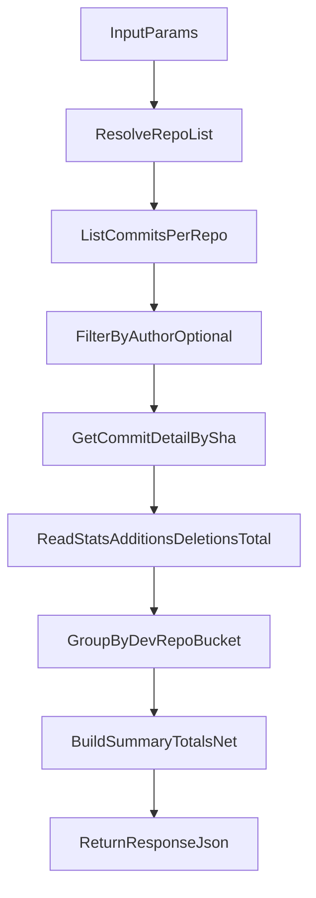

# GitHub API Handle Phase Spec

## 1) Objective

Muc tieu cua handle phase la tong hop dong gop GitHub theo:

- so commit
- additions
- deletions
- net = additions - deletions

Output can ho tro group theo:

- developer
- repository
- bucket thoi gian (`day | week | month`)

## 2) Input Contract

Handle phase nhan cac input sau:

- `owner` hoac `org` (bat buoc)
- `repos` (optional): danh sach repo chi dinh truoc; neu bo trong thi auto-discovery tu org
- `from` (bat buoc): ISO date/time, vi du `2026-04-01T00:00:00Z`
- `to` (bat buoc): ISO date/time, vi du `2026-04-30T23:59:59Z`
- `dev` (optional): GitHub username/email cua 1 developer; neu bo trong thi lay toan team
- `bucket` (optional): `day | week | month`, mac dinh `day`

## 3) Endpoint Mapping

### 3.1 List repositories

`GET /orgs/{org}/repos`

Use case:

- lay danh sach repos khi khong co `repos` input.

### 3.2 List commits

`GET /repos/{owner}/{repo}/commits`

Query params can dung:

- `author` = github username hoac email
- `since`
- `until`
- `per_page` (toi da 100)
- `page`

Ghi chu quan trong:

- endpoint nay dung de lay commit SHA va metadata.
- khong su dung endpoint nay lam nguon chinh de tinh tong line code.

### 3.3 Get commit detail

`GET /repos/{owner}/{repo}/commits/{sha}`

Lay truong:

- `stats.additions`
- `stats.deletions`
- `stats.total`

Day la du lieu chinh de tinh line code cho tung developer.

## 4) Processing Algorithm (Handle Phase)

1. Resolve repository list:
   - Neu co `repos` input => dung truc tiep.
   - Neu khong co => goi list org repos de lay danh sach repo.
2. Voi tung `repo`, goi list commits theo `since/until`.
3. Neu query theo 1 developer thi truyen `author` ngay tu list commits.
4. Duyet tung commit SHA:
   - Goi get commit detail.
   - Doc `stats.additions`, `stats.deletions`, `stats.total`.
5. Chuan hoa identity developer theo uu tien:
   - `author.login` -> `author.email` -> `author.name` -> `unknown`.
6. Aggregate du lieu:
   - theo `developer + repo + bucket`.
   - cong don `commits`, `additions`, `deletions`.
   - tinh `net = additions - deletions`.
7. Build summary:
   - tong toan bo repos.
   - tong theo tung repo.
   - tong theo tung developer (neu can cho dashboard/leaderboard).

## 5) Aggregation Rules

- Dedupe key commit: `repo + sha` de tranh double count.
- Exclude bot commits theo pattern config (vi du `bot`, `dependabot`).
- Date filtering:
  - commit count dua vao `committedAt`.
  - chi tinh nhung commit trong khoang `from -> to`.
- Khi co `dev` filter, chi giu commit cua dev do sau normalize identity.

## 6) Output Schema

Response nen giu dang:

```json
{
  "developer": "vu-phan",
  "from": "2026-04-01",
  "to": "2026-04-30",
  "repos": [
    {
      "repo": "converter-pdf-backend",
      "commits": 34,
      "additions": 1250,
      "deletions": 430,
      "net": 820
    }
  ],
  "summary": {
    "commits": 34,
    "additions": 1250,
    "deletions": 430,
    "net": 820
  }
}
```

Neu output all team, co the mo rong:

- `developers[]` cho breakdown theo tung nguoi.
- `repos[]` cho breakdown theo tung repo.
- `summary` cho tong cong team.

## 7) Operational Constraints

- Pagination:
  - su dung `per_page <= 100`.
  - lap theo `page` den khi het du lieu.
- Concurrency:
  - gioi han so request get-commit-detail dong thoi de tranh vuot rate limit.
  - khuyen nghi pool 5-10 request song song tuy theo quota.
- Retry/backoff:
  - retry voi `403 rate limit`, `429`, `5xx`.
  - exponential backoff + jitter.
- Caching (khuyen nghi):
  - cache repo list va commit summary theo key:
    `org:repo:from:to:dev:bucket`.

## 8) Security Requirements

- Khong hardcode PAT trong source code hoac docs.
- Authorization header phai dung env var:
  - `Authorization: Bearer ${GITHUB_TOKEN}`
- Neu token lo ra ngoai:
  - rotate ngay lap tuc.
  - audit log va cap nhat secret store.

Safe curl example:

```bash
curl --location "https://api.github.com/orgs/${GITHUB_ORG}/repos" \
  --header "Accept: application/vnd.github+json" \
  --header "Authorization: Bearer ${GITHUB_TOKEN}" \
  --header "X-GitHub-Api-Version: 2026-03-10"
```

## 9) Handle Flow Diagram



## 10) Acceptance Criteria

- Tai lieu neu ro ly do can goi get commit detail de lay line stats.
- Co input/process/output ro rang, implement duoc ngay.
- Co quy tac pagination, concurrency, retry va dedupe.
- Khong con token that trong tai lieu.
